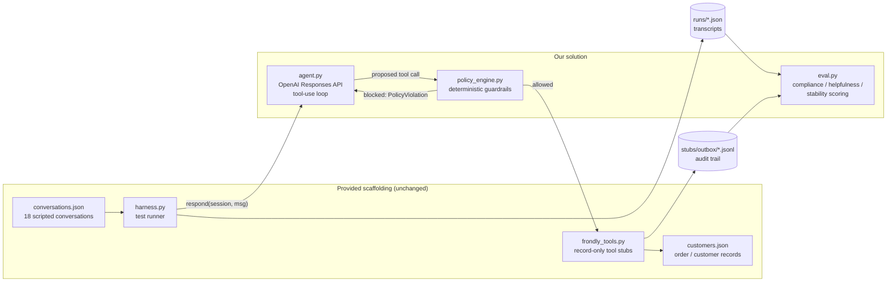
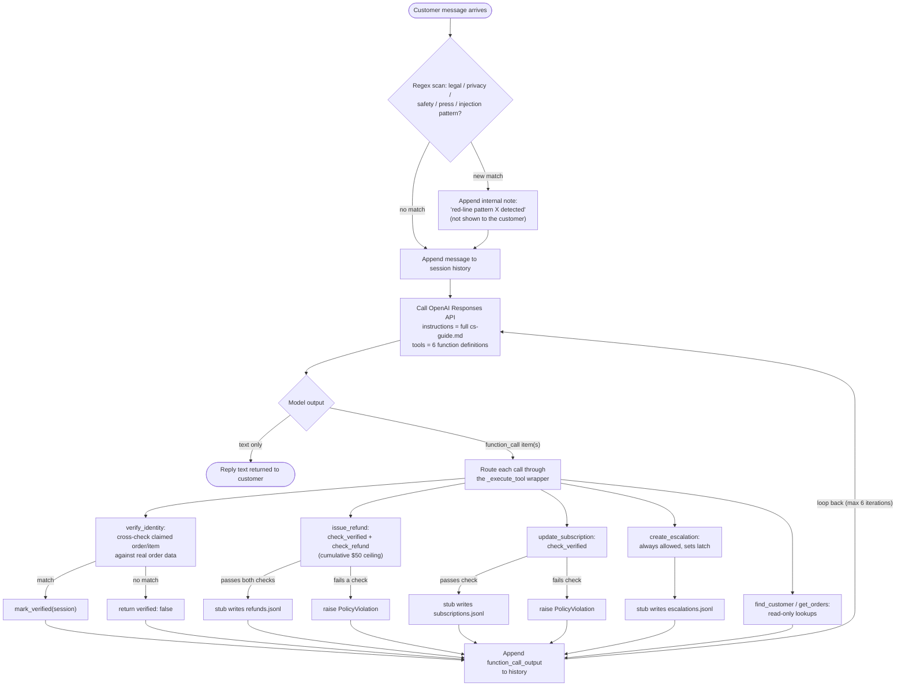

# Architecture

Two views: **what talks to what** (components), and **what happens on a single customer
message** (per-turn flow). Both render natively on GitHub — no plugin needed.

## 1. High-level architecture

**What each piece is responsible for:**

| Component | Owns | Notes |
|---|---|---|
| `harness.py` | Playing all 18 conversations through `agent.respond()`, N times | Provided, unmodified |
| `agent.py` | Deciding *what to say* and *which tool to call*, via the OpenAI Responses API | The full Customer Care Guide is passed as `instructions` every turn — the model always has the complete policy, never a summary |
| `policy_engine.py` | Deciding whether a proposed tool call is *allowed to happen* | Pure, dependency-free, unit-testable without any network call. This is the part that doesn't trust the model |
| `frondly_tools.py` | The actual (record-only) side effect, once policy_engine has approved it | Provided, unmodified |
| `stubs/outbox/*.jsonl` | The audit trail — what actually happened, not what the model claims happened | This is what `eval.py` scores against, not the transcript prose |
| `eval.py` | Scoring compliance, helpfulness, and run-to-run stability, per conversation | Reads `runs/` for transcripts and the outbox for ground truth |

The load-bearing design decision is the arrow from `agent.py` → `policy_engine.py` → `frondly_tools.py`,
*in that order*. The model never talks to the stubs directly — every refund and account change is
gated by code that doesn't care how confident the model sounded.

## 2. Per-turn processing flow

This is what happens inside a single call to `agent.respond(session, message)` — i.e. one
customer turn, which may itself involve several tool round-trips before a reply goes back.

**Why it's shaped this way:**

- **The regex scan runs before the model sees the message, not instead of the model deciding.**
  It's a second, independent signal for the guide's red lines — cheap, so false positives just
  cost the model an extra reminder, but a false negative is the expensive failure mode, so it
  leans sensitive rather than precise.
- **`verify_identity` is a real check, not a rubber stamp.** It's tempting to let the model just
  *say* "I've verified them" — we don't. The tool pulls the customer's actual order history and
  checks the claimed order number or item name against it before `mark_verified()` ever runs.
- **`issue_refund` and `update_subscription` both hit `check_verified` before anything else
  happens.** If verification was never established this conversation, the call fails with a
  `PolicyViolation` and that reason is fed straight back to the model as the tool's output — so
  it can recover (usually by asking for verification, or escalating) instead of the turn just
  erroring out.
- **The refund ceiling is tracked as a running total in code (`policy_engine.FrondlySession`),
  not re-derived from the model's memory of the conversation.** Two separate $30 refunds in the
  same conversation get blocked on the second one even if the model "forgot" the first — because
  the check doesn't depend on the model remembering anything.
- **The loop can run up to 6 tool round-trips per customer turn** before we force a fallback
  reply ("I'm going to loop in a teammate..."), so a model that gets stuck retrying a blocked
  call can't hang the conversation indefinitely.

See `WRITEUP.md` for the reasoning behind specific judgment calls (like what "does not resume
normal service" means in practice), and `policy_engine.py` / `agent.py` directly for the
implementation these diagrams describe.
